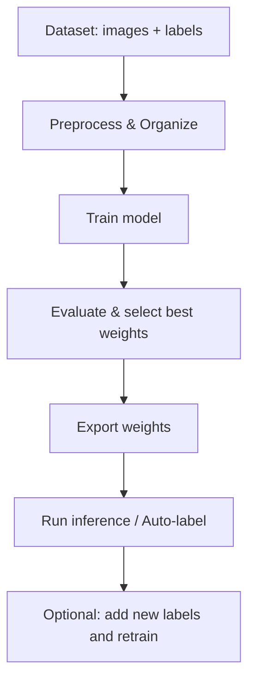

# Animal Detection using YOLOv8

This repository contains code for training and running an animal detection model using YOLOv8.

**Note:** The dataset is NOT included in this repository due to large file sizes. You can download or prepare datasets from any relevant sources (see links below).

**Project structure (important parts):**

- `animal_detection.py` - training/inference script
- `auto_label.py` - helper to auto-label images
- `yolov8n.pt` - YOLOv8 pretrained weights (small)
- `dataset/`, `leopard/`, `wildboar/` - expected dataset folders (ignored by `.gitignore`)
# Animal Detection using YOLOv8

This repository contains code for training and running an animal detection model using YOLOv8.

**Note:** The dataset is NOT included in this repository due to large file sizes. You can download or prepare datasets from any relevant sources (see links below).

**Project structure (important parts):**

- `animal_detection.py` - training/inference script
- `auto_label.py` - helper to auto-label images
- `yolov8n.pt` - YOLOv8 pretrained weights (small)
- `dataset/`, `leopard/`, `wildboar/` - expected dataset folders (ignored by `.gitignore`)


Getting started
---------------

1. Create and activate a virtual environment (this repo already uses `animal_env/` but you can create your own):

```powershell
python -m venv animal_env
& .\animal_env\Scripts\Activate.ps1
pip install -r requirements.txt
```

2. Add your dataset into the expected folders. Example structure:

```
dataset/
  images/
    train/
    val/
  labels/
    train/
    val/
leopard/
  data/
    train/
    val/
wildboar/
  data/
    train/
    val/
```

3. Train (example):

```powershell
python animal_detection.py
```

4. Auto-label (example):

```powershell
python auto_label.py
```

Dataset sources
---------------

- Kaggle datasets (search for terms like "leopard", "wild boar", "animal detection"): https://www.kaggle.com/datasets
- Leopard dataset (images.cv): https://images.cv/dataset/leopard-image-classification-dataset?utm_source=chatgpt.com
- Wild boar download (images.cv): https://images.cv/download/wild_boar/1151

If you use large datasets, keep them out of the repository (they are intentionally excluded).

Workflow
--------

This section describes the typical workflow for preparing data, training, and running inference with this repository.

1. Obtain or collect images and organize them into the repository folders.
2. Prepare YOLO-format labels (one `.txt` per image) and place them alongside images.
3. Configure training parameters in `animal_detection.py` (dataset paths, epochs, batch size).
4. Train the model and monitor validation metrics.
5. Export the best weights and use them for inference or auto-labeling additional images.

Mermaid workflow diagram (paste inside a ```mermaid fenced block if your viewer requires it):



License & contact
------------------

This project is provided as-is. Open an issue or PR in the repository for questions or improvements.
